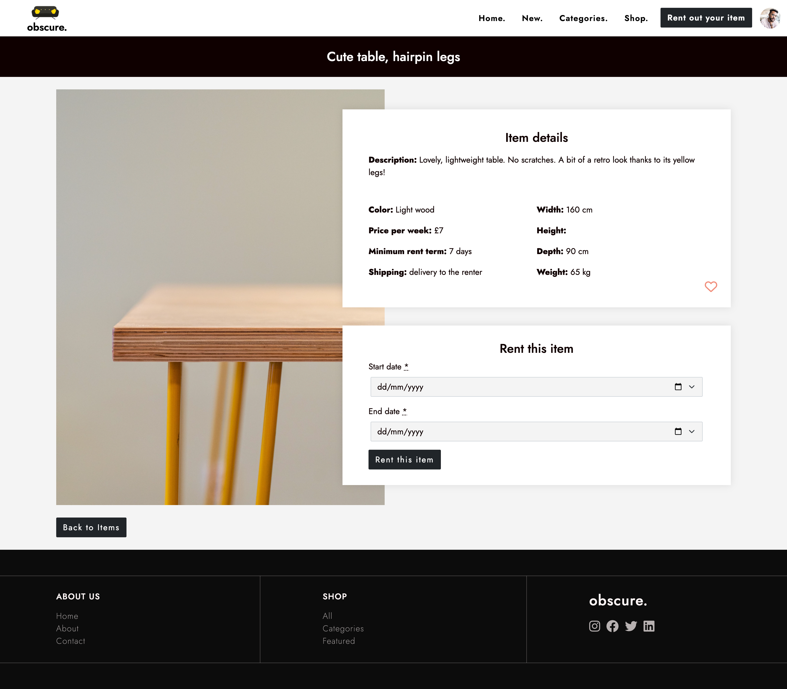
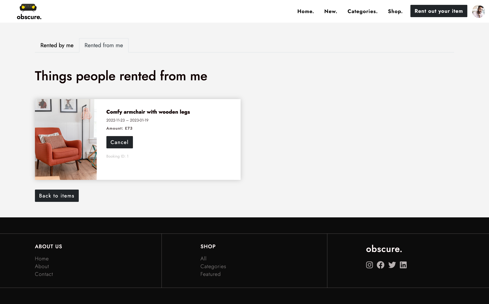
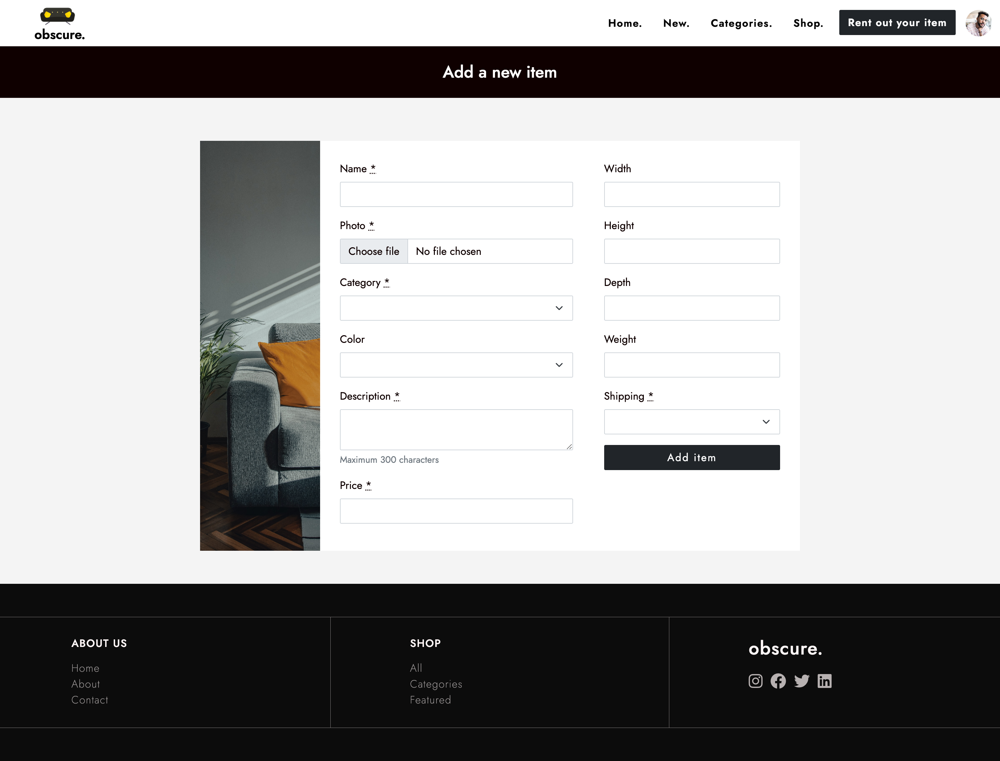

# obscure.

Obscure is a furniture rental marketplace (desktop version) built for educational purposes using Ruby on Rails framework.

## Overview

### User journeys

Visitors are able to:
- Visit home page with newly added items and main categories
- See all furniture items offered for renting and search/filter them
- See detailed information about particular item

Logged-in users are able to:
- Add and rent out their own items
- Edit/delete their own items
- Rent items offered by other users
- Cancel bookings
- See all items rented by them and from them
- Add items to Wishlist
- See all items added to Wishlist

### Screenshot examples

- Home page

- Items index page

- Items show page

- Bookings page

- Add a new item form

### Links

- Live Site URL: [Obscure Furniture](https://obscure.up.railway.app/)

## Our process

### Built with

- Ruby
- Ruby on Rails 7
- PostgreSQL
- Stimulus JS
- AJAX
- Hotwire Turbo
- HTML
- SASS
- Bootstrap

### Learnings + future focus

The main purpose of this project was to practice creating a marketplace using Ruby on Rails framework and modern web development workflow. It was a great way to master all basic CRUD actions, practice using AJAX for dynamic searching as well as using Turbo Streams to apply rails validations and render errors to users.

Possible future steps:
- Adding a mobile version
- Adding a calendar so that users can see when the item is already rented out
- Adding confirmation system for bookings: a new booking is pending until the owner of the item confirms it
- Integration with Stripe to allow online payments after booking
- Further refactoring

## Team

- Zhanna Doronina - [jane-doronina](https://github.com/jane-doronina)
- Becky Amara - [beckyamara](https://github.com/beckyamara)
- Marion Salaun - [marionator](https://github.com/Marionator)
- Yunfei Zhao - [YunfeiJennifer](https://github.com/YunfeiJennifer)
